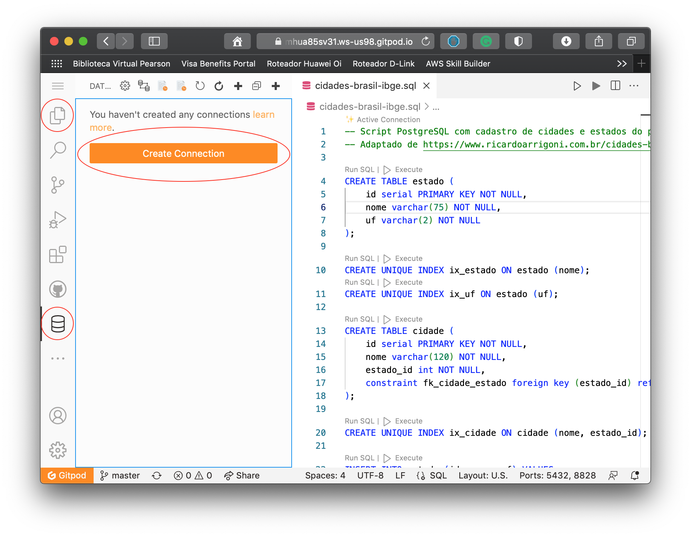

## Postgres Playground

Clique no botão acima para abrir o projeto no [GitPod](https://gitpod.io)
contendo um servidor Postgres, um VS Code e uma extensão para administração
do banco, tudo pronto pra ser usado.

A inicialização do ambiente demora alguns segundos. Depois que a página carregar,
ainda demora mais alguns instantes para a extensão para Postgres ser instalada no 
VS Code.

Depois disso, você terá um ambiente como da imagem abaixo.

